# Ejemplos basicos #

## Ejemplo 1 ##
El siguiente ejemplo muestra un uso de las llamadas de sistema Posix [```getpid```](https://pubs.opengroup.org/onlinepubs/9699919799/) y [```sleep```](https://pubs.opengroup.org/onlinepubs/9699919799/).

**Codigo**: [example1.c](./code/example1.c)

```C
#include <stdio.h>
#include <unistd.h>

/*
gcc -Wall example1.c -o example1.out

-> sleep
-> getpid
*/

int main (void){
  int pid_proceso = getpid();
  printf("Empezando proceso %d\n", pid_proceso);
  for(int i = 0; i < 3; i++) {
    sleep(1);
    printf("i = %d\n", i);
  }
  printf("Finalizando proceso %d\n", pid_proceso);
  return 0;
}
```

**Compilación y ejecución**: 

```bash
gcc -Wall example1.c -o example1.out
./example1.out
```

La salida en pantalla tras ejecutar el código anterior se muestra a continuación:

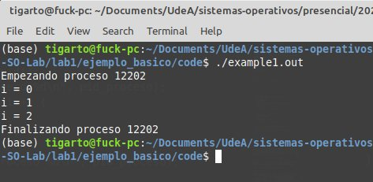

**Llamadas**: A continuación se muestra el diagrama de llamadas del ejemplo anterior:

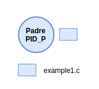

**Familia de procesos**: La familia de procesos se muestra a continuación:

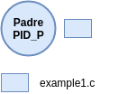


## Ejemplo 2 ##
El siguiente ejemplo ademas de las llamadas mostradas previamente ([```getpid```](https://pubs.opengroup.org/onlinepubs/9699919799/) y [```sleep```](https://pubs.opengroup.org/onlinepubs/9699919799/)) se hace uso de la llamada [```fork```](https://pubs.opengroup.org/onlinepubs/9699919799/) para crear un hijo a partir del proceso padre. El proceso hijo creado será un clon del proceso padre.


**Codigo**: [example2.c](./code/example2.c)

```C
#include <stdio.h>
#include <unistd.h>

/*
#include <stdio.h>
#include <unistd.h>

gcc -Wall example2.c -o example2.out

-> sleep
-> getpid
-> fork
*/
int main (void){
  char rol;
  int fin = 2;
  int i;
  printf("Empezando proceso %d\n", getpid());  
  if(fork() == 0) {
     // Codigo hijo
     rol = 'H';
     printf("Empezando proceso %d\n", getpid()); 
     fin = fin + 3;
     for(i = 0; i < fin; i++) {
       sleep(1);
       printf("%c -> i = %d\n",rol ,i);
     }
   }
   else {
     // Codigo padre
     rol = 'P';
     for(i = 0; i < fin; i++) {
       sleep(1);
       printf("%c -> i = %d\n",rol ,i);
     }
   }
   // Codijo ejecutado por ambos (para el caso)
   printf("%c -> i = %d\n",rol ,i);
   printf("Finalizando proceso %d\n", getpid());
   return 0;
}
```

**Compilación y ejecución**:

```bash
gcc -Wall example2.c -o example2.out
./example2.out
```

La salida en pantalla tras ejecutar el código anterior se muestra a continuación:

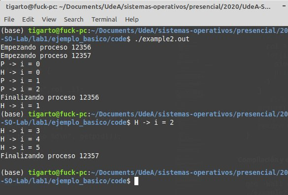

**Llamadas**: El diagrama de llamadas se muestra a continuación. Notese que una vez el proceso hijo se crea este sigue una existencia a parte del proceso padre, pero en ambos casos ambos estaran relacionados el mismo codigo ejecutable (**ejemplo2.out**). 

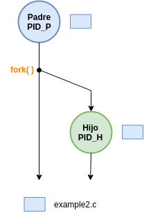

**Familia de procesos**: Para el caso, ya se puede ver que el padre tiene una un hijo debido a la llamada [```fork```](https://pubs.opengroup.org/onlinepubs/9699919799/)

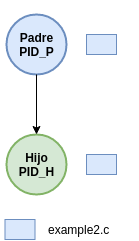

## Ejemplo 3 ## 

En los ejemplo 1 y 2 se vieron las llamadas: [```getpid```](https://pubs.opengroup.org/onlinepubs/9699919799/), [```sleep```](https://pubs.opengroup.org/onlinepubs/9699919799/) y [```fork```](https://pubs.opengroup.org/onlinepubs/9699919799/). En este ajemplo se agrea la llamada [```wait```](https://pubs.opengroup.org/onlinepubs/9699919799/) cuyo objetivo es hacer que el padre espere que culmine el proceso hijo. Una vez que esto sucede el padre continua su ejecución hasta terminar.

**Codigo**: [example3.c](./code/example3.c)

```C
#include <stdio.h>
#include <unistd.h>
#include <sys/types.h>
#include <sys/wait.h>

/*
gcc -Wall example3.c -o example3.out

-> sleep
-> getpid
-> fork
-> wait
*/
int main (void){
  char rol;
  int fin = 2;
  int i;
  int estado;
  printf("Empezando proceso %d\n", getpid());  
  if(fork() == 0) {
     // Código hijo
     rol = 'H';
     printf("Empezando proceso %d\n", getpid()); 
     fin = fin + 3;
     for(i = 0; i < fin; i++) {
       sleep(1);
       printf("%c -> i = %d\n",rol ,i);
     }
   }
   else {
     // Código padre
     rol = 'P';
     for(i = 0; i < fin; i++) {
       sleep(1);
       printf("%c -> i = %d\n",rol ,i);
     }
     int pid_h_espera = wait(&estado);
     if (pid_h_espera == 0) {
       printf("Bien chino - status: %d\n",estado);
       printf("Finish him: %d\n", pid_h_espera);
     }
     else {
       printf("Esperando al chino - status: %d\n",estado);
       printf("pid espera: %d\n", pid_h_espera);
     }   
     printf("\n");
   }
   // Código ejecutado por ambos (para el caso)
   printf("%c -> i = %d\n",rol ,i);
   printf("Finalizando proceso %d\n", getpid());
   return 0;
}
```

**Compilación y ejecución**:

```bash
gcc -Wall example3.c -o example3.out
./example3.out
```

La salida en pantalla tras ejecutar el código anterior se muestra a continuación:

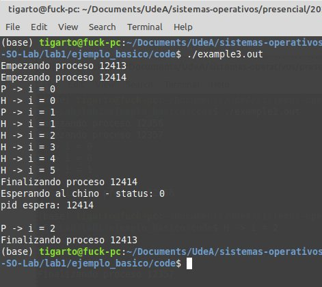

**Llamadas**: El diagrama de llamadas que se muestra a continuación muestr que el padre espera a que el hijo culmine.

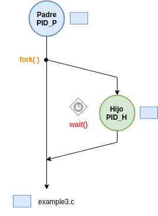

**Familia de procesos**: Respecto a la grafica de la familia de procesos es la misma del ejemplo 2.

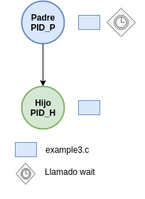


## Ejemplo 4 ## 

En este ejemplo se muestra el uso de una de las llamadas de la familia de funciones ```exec``` (```execl```, ```execlp```, ```execle```, ```execv```, ```execvp```). Mas exactamente en este caso se hizo uso de la función [```execl```](https://pubs.opengroup.org/onlinepubs/9699919799/)


**Código fuente del proceso que será tomado como padre**: [example4_p.c](./code/example4_p.c)

```C
#include <stdio.h>
#include <unistd.h>
#include <sys/types.h>
#include <sys/wait.h>

/*
gcc -Wall example4_p.c -o example4_p.out

-> sleep
-> getpid
-> fork
-> wait
-> exec
*/
int main (void){
  int *status_code;
  printf("Padre -> \n");
  switch(fork()) {
    case 0:
      // Codigo del proceso hijo
      execl("./example4_h.out", "./example4_h.out", NULL);
    case -1: 
      // Error
      printf("ERROR!!!");
      break;
  }
  wait(status_code); // Ensayarlo sin comentarlo y comentandolo a ver que pasa
  printf("Esto no lo ejecutara el hijo\n");
  return 0;
}
```

Notese que el códido fuente del padre donde hace el llamado a las funciones ```fork``` y ```exec``` (Pero pilas, el que hace el llamado al ```exec``` es el proceso hijo). Para el caso, el padre llama primero a ```fork``` para crear un hijo clon. Luego, en la sección de codigo asociada al proceso hijo se procede a llamar a la función ```exec``` para sobreescribir la imagen que ejecuta el proceso padre (para nuestro caso example4_p.out) con la que se desea que se ejecute en el proceso hijo (para nuestro caso example4_h.out). Esta imagen es la del ejecutable asociado a este. Para el caso, este se muestra a continuación:

**Código fuente del proceso que será tomado como hijo**: [example4_h.c](./code/example4_h.c)

```C
#include <stdio.h>
#include <unistd.h>
#include <sys/types.h>
#include <sys/wait.h>

/*
gcc -Wall example4_h.c -o example4_h.out

-> sleep
-> getpid
*/

int main (void){
  for(int i = 0; i < 3; i++) {
    sleep(1);
    printf("i = %d\n", i);
  }
  return 0;
}
```

**Compilación y ejecución**:

1. **Compilación**

```bash
gcc -Wall /example4_p.c -o /example4_p.out
gcc -Wall /example4_h.c -o /example4_h.out
```

2. **Ejecución**

```bash
./example4_p.out
```

La salida en pantalla tras ejecutar el código anterior se muestra a continuación; notese que solo se llama al proceso padre:

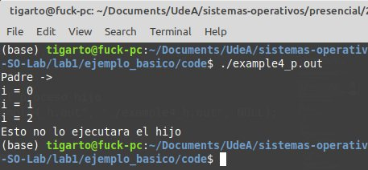

**Llamadas**: Notese que en el diagrama siguiente que una vez el proceso hijo llama al ```exec``` la imagen del ejecutable procediente del ```fork``` (la misma del padre) es reemplazada por la imagen del ejecutable pasada como parametro a la llamada ```exec```, la cual suele ser distinta que la del padre.

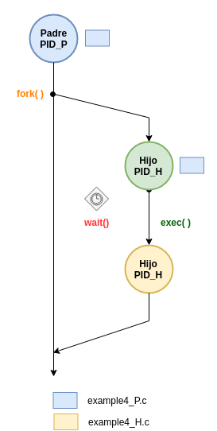

**Familia de procesos**: La jerarquia de la familia de procesos sigue siendo la misma que la de los ejemplos 1, 2 y 3.

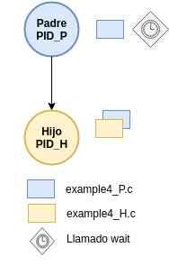

## Resumen ##

La siguiente figura muestra la familia de funciones para cada uno de los ejemplos vistos anteriormente. Notese que el unico que es diferente de los demas es el ejemplo 1 pues este no crea hijos. Para los demas el resultado es similar por que en todos los casos se crea **solo un hijo**.

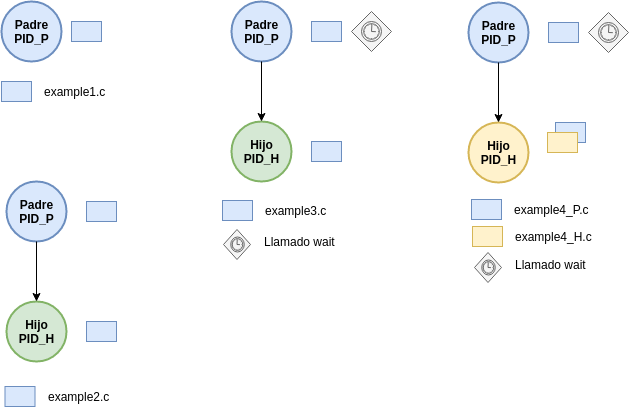


Ahora bien, la diferencia en los ejemplos en los que se crea el hijo (2, 3 y 4) radica en el hecho en como se llevo a cabo dicha creación mediante la invocación de las llamadas de sistema, esta puede ser mejor vista en el diagrama de llamadas (por lo menos ```wait```, ```fork``` y ```exec```) donde se puede apreciar el efecto en los procesos analizados. 

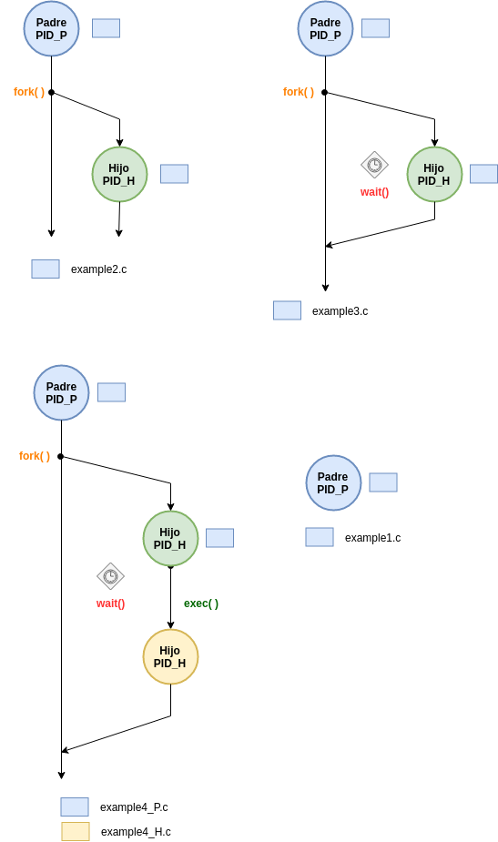

## Referncias ##

1. https://pubs.opengroup.org/onlinepubs/9699919799/
2. http://manpages.ubuntu.com/