# Introducción muy basica al manejo de gdb #

## Antes de empezar ##

## Paao 1 ##
Revise el contenido de apoyo descrito a continuación:
1. [GDB Tutorial A Walkthrough with Examples](./refencias/gdb-tutorial-handout.pdf)
2. [gdb Cheatsheet](./refencias/gdb.pdf)
3. [GDB Cheat Sheet](./refencias/GDB-cheat-sheet.pdf)

Mas documentos pueden ser encontrados en el directorio [referencias](./referencias)

## Paso 2 ##
Complemente el contenido anterior viendo el video: [GDB](https://www.youtube.com/watch?reload=9&v=G4OIp_5fF1A). 

## Paso 3 ##
Para el laboratorio se hará uso del **gdb** disponible en la maquina con linux. Sin embargo lo animamos a que haga uso de otras alternativas más amigables como [onlinegdb](https://www.onlinegdb.com/) o [gdbgui](https://www.gdbgui.com/).

## Haciendo unos ensayos previos para comprender el codigo ##

### Codificación del programa ###

Codifique el siguiente programa guardandolo como ```main.c```


```C
#include <stdio.h>

int main() {
  int f1 = factorial(4);
  int f1 = factorial_recursivo(5);
  printf("4! = %d\n",f1);
  printf("5! = %d\n",f2);
  return 0;
}

int factorial(int num){
  fac = 1;
  for(int = 1; i <= num;i++) {
    fac = fac*i;  
  }
  return fac;
}

int factorial_recursivo(int num){
  if(num  > 0) {
    return num*factorial_recursivo(num - 1);
  }
  else {
    return 1;
  }
}
```

Usando el siguiente comando compilelo, si tiene errores corrijalo (para ver respuesta seguir el siguiente [enlace](main.c)):

```
gcc -Wall -g main.c -o main.out
```

**Pregunta**:
1. Como se puede notar, se observa un nuevo parametro en el gcc, este es ```-g```. ¿Que significa este?

Una vez que tenga todo corregido continue los pasos dados en la siguiente sección:

### Cacharreando con el gdb ###

#### Arrancando el gdb ####

Para iniciar el **gdb** se emplea el comando ```gdb```, sin embargo usar este solo hacer el debug no es amigable asi que se recomuenta agregar el parametro adicional ```-tui```. De este modo, el comando será:

```
gdb -tui
```

Una vez se esta dentro del ```gdb``` se carga la consola de este esperando la entrada de comandos propios del ```gdb```. Esta tiene la siguiente forma:

```
(gdb) 
```

#### Conociendo los comandos disponibles ####

Para tal fin se usan los comandos:
* ```help```
* ```help all```
* ```help [comando]```
* ```apropos word```


#### Cargando un archivo en el gdb ####

Una vez el gdb arranco (```gdb -tui```) se carga un archivo mediante el comando:

```
file nombreEjecutable
```

Asi para nuestro caso como el ejecutable se llama **main.out** el comando será:

```
file file.out
```

El resultado de esto aparece a continuación:

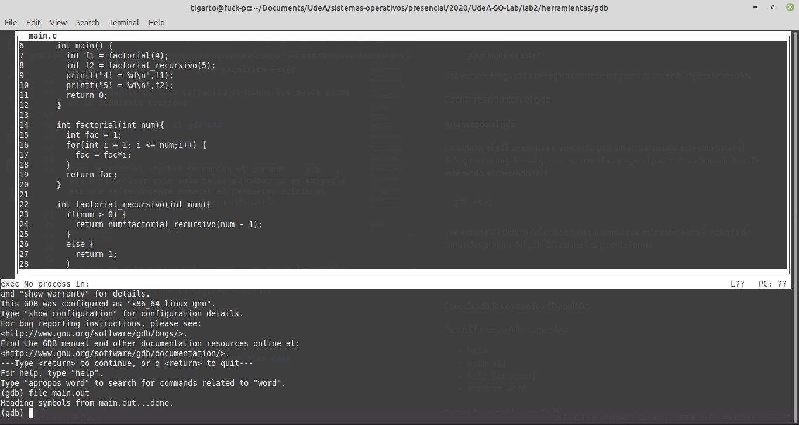

#### Visualizando el archivo fuente cargado en el gdb ####

El comando mas practico para esto es ```[l]ist```, en los documentos de las referencias puede encontrar mas exacamente como usar este comando. Por ahora vamos a ejecutar los siguientes comandos (asumiendo que ya se cargo el archivo en el  gdb):

```
# Comando 1
l
# Comando 2
l
# Comando 3
l
```

La salida es algo como lo siguiente:

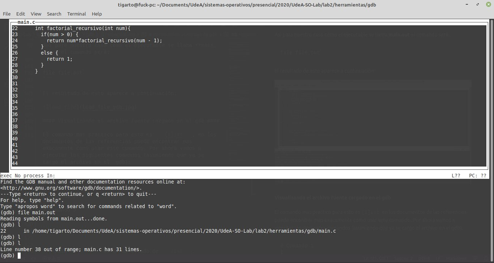

Continuando con la aplicación de los comandos tenemos:

```
# Comando 4
l 1
```


* **Nota**: ```l``` es el abreviado de ```list```.

#### Ejecutando el archivo en el gdb ####

Con el comando list anteriormente mencionado se pudo visualizar el condigo fuente del ejecutable al cual se le esta haciendo el debuging. Con el comando ```run``` se ejecuta el programa:

```
run
```

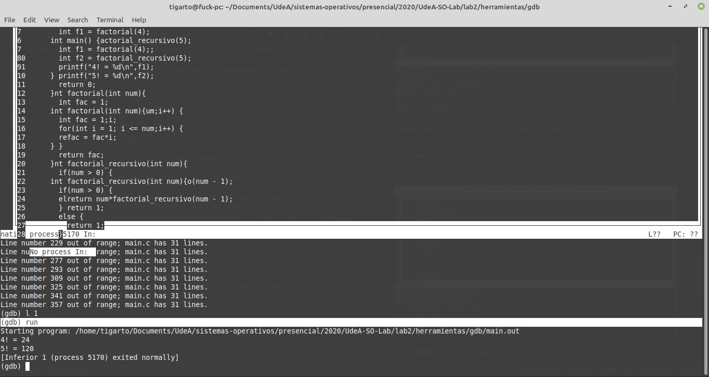

Una vez ejecutado el programa si lo que se quiere es ejecutarlo nuevamente se puede correr nuevamente este comando.

#### Colocando breakpoints ####

Un **breakpoint** hace referencia a un punto de parada en la ejecución del codigo. Estos son muy comunes para el desarrollo de pruebas de escritorio ya que permiten ir evaluando el estado de las variables a medida que el programador va moviendose entre estos. El comando para poner un breakpoint es ```[b]reak``` y sus diferentes variantes pueden consultarse en las referencias de apoyo dispuestas. Por ahora ejecutemos los siguientes comandos. Antes de esto tenga en cuenta que el abreviado  del comando ```break``` es ```b``` y es con este ultimo que se ejecutan los ejemplos:


```
# Comando 1
b 4
# Comando 2
break 9
# Comando 3
b factorial
```

La siguiente figura muestra el resultado:

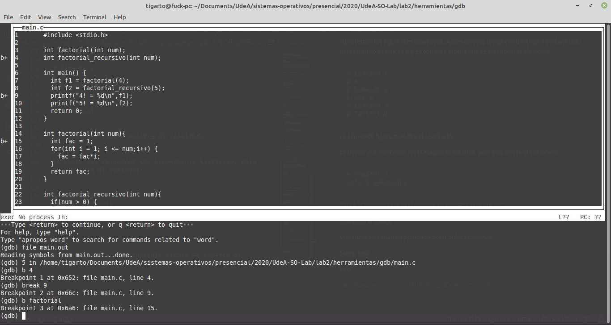

Notese de la figura anterior, los simbolos **b+** agregados a la izquierda del codigo. Es alli donde se colocaron los breakpoints. Es bueno vez colocados los breakpoints listarlos, para ello se usa el comandos:

```
# Comando 4
info breakpoints
```

La siguiente figura muestra el resultado:

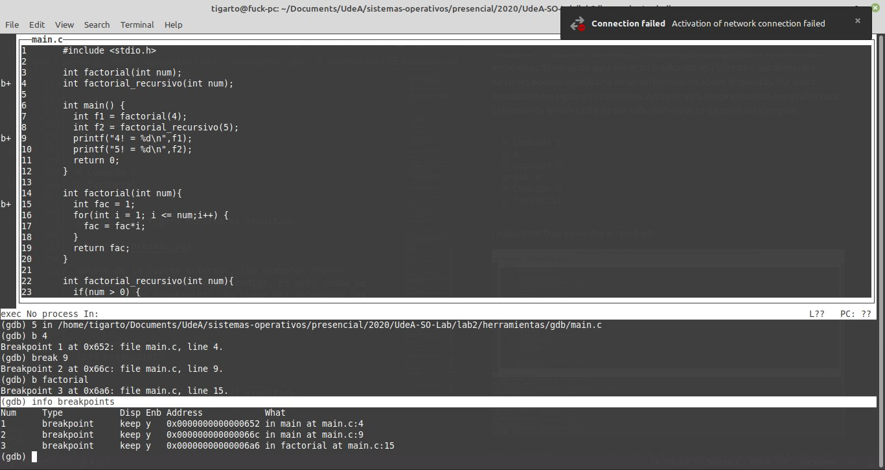

Notese que cada breakpoint tiene información asociada a este pero resaltamos la primera columna en la cual se puede ver el numero del breakpoint. Conocer este numero es importante por que es el que se emplea para eliminar o desabilitar un breakpoint determinado. Para ello vamos a realizar las siguientes tareas:
1. Agregar un breakpoint en la función ```factorial_recursivo``` 
2. Listar los breakpoints disponibles.
   
```
# Comando 5
break factorial_recursivo

# Comando 6
info breakpoints
```

En la siguiente figura se muestra el resultado:

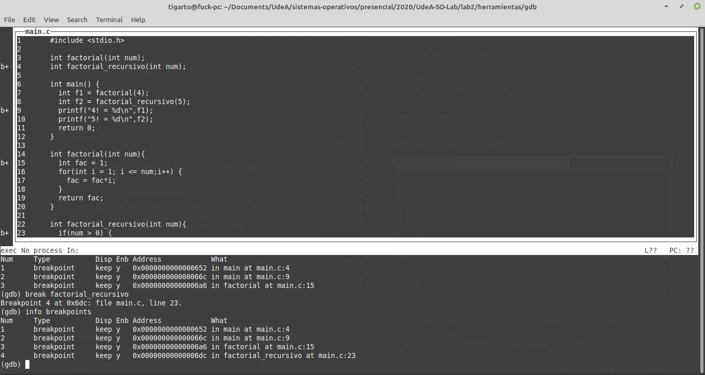

3. Deshabilitar el breakpoint anteriormente agregado (ojo tenga en cuenta el numero de este).
4. Listar los breakpoints disponibles para ver los cambios.

```
# Comando 7
disable 4

# Comando 8
info breakpoints
```

En la siguiente figura se muestra el resultado. Observe los cambios:

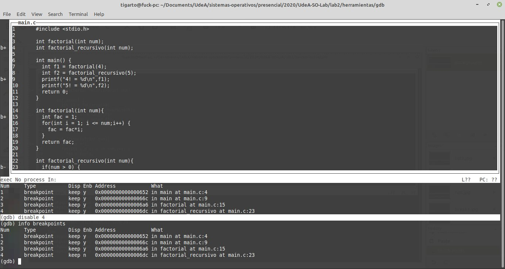

5. Eliminar el breakpoint anterior y listar nuevamente los breakpoints disponibles para ver los cambios. 

```
# Comando 9
delete 4

# Comando 10
info breakpoints
```

Para el caso, en la siguiente figura se muestra el resultado:

En la siguiente figura se muestra el resultado. Observe los cambios:

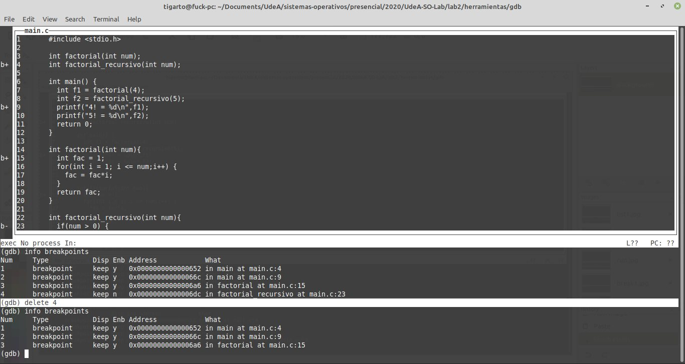

#### Moviendonos entre los breakpoints y observando la evolución de las variables ####

Para movernos entre los breakpoints se usa la instrucción ```[c]ontinue``` (donde ```c``` es el abreviado de ```continue```) sin argumentos (pues tambien admite argumentos pero para nuestros propositos no lo vamos a profundizar). Por otro lado, para ver el estado de las variables se procede a usar el comando ```print```. Realicemos las siguientes tareas para comprender en su forma mas basica el uso conjunto de estas:

1. Agregue un breakpoint en la linea 17.

```
# Comando 1
b 17

# Comando 2
info breakpoints
```

El resultado se muestra en la siguiente figura:

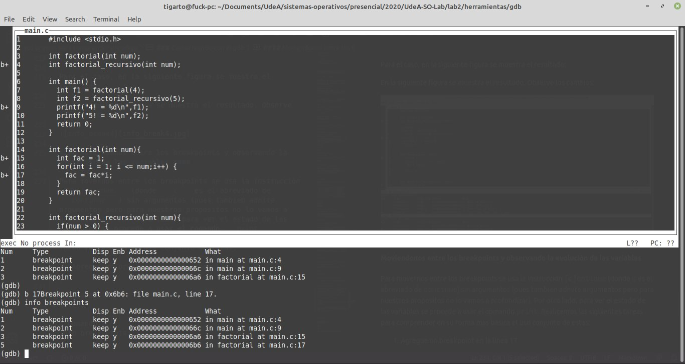

2. Empieze la ejecución del programa con run. Observe donde se detiene el programa e imprima el contenido de las variables ```f1``` y ```f2```.

```
# Comando 3
run

# Comando 4
print f1

# Comando 5
print f2
```

El resultado se muestra en la siguiente figura:

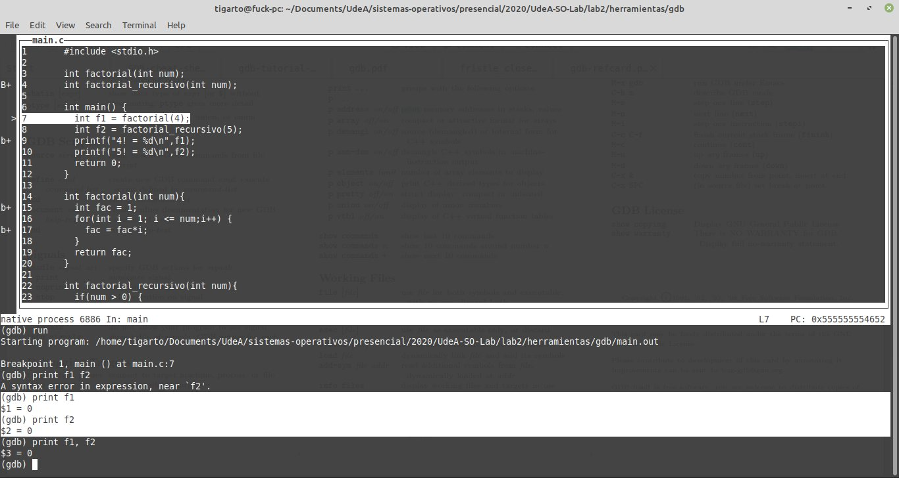

Notese en la figura anterior, que la linea en la que se encuentra el primer breakpoint queda resaltada. Tenga en cuenta que esta, aun no se he ejecutado.

3. Ejecute el comando ```continue``` y luego imprima el contenido de las variables ```fac``` y ```f1```. ¿Que es lo que se imprime para estas y por que?

```
# Comando 6
c

# Comando 7
print fac

# Comando 8
print f1
```

El resultado se muestra en la siguiente figura:

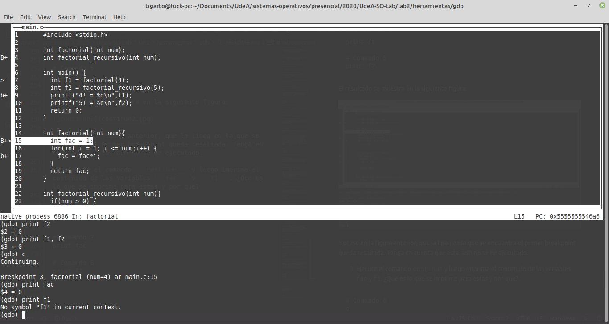

Notese que ya el programa se encuentra en la linea **15**. 

4. Agregue un breakpoint en la linea **17** y verifique que este se ha agregado:

```
# Comando 9
b 17

# Comando 10
info breakpoints
```  

La salida se muestra a continuación:

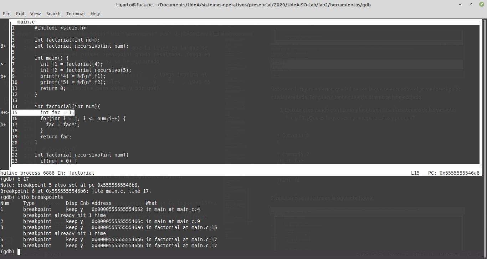

5. Proceda con un ```continue``` e imprima ```fac```.

```
# Comando 11
c

# Comando 12
print fac
``` 

La salida se muestra a continuación:

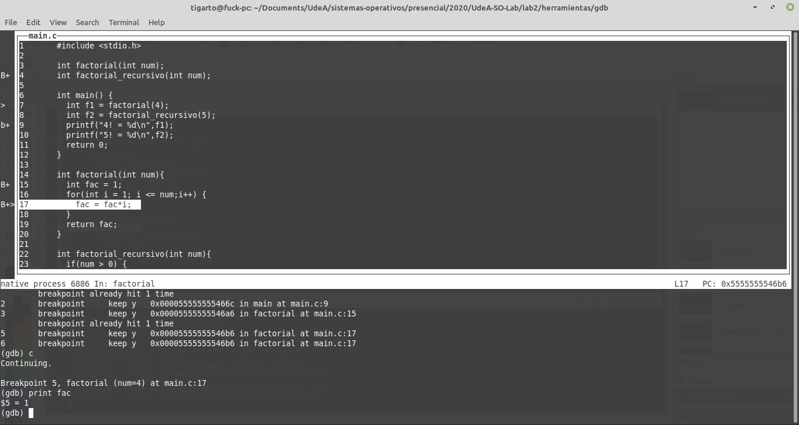

6. Ejecute dos veces ```continue``` e imprima el valor de la variable ```fac```.


```
# Comando 13
c

# Comando 14
c

# Comando 15
print fac
``` 

La salida se muestra a continuación (**nota**: No se ejecuto aqui exactamente la misma lista de comandos, pues, se ejecuto un print mas despues del primer continue):


7. Mire el numero al que corresponde el breakpoint de la linea **17**, luego deshabilitelo y compruebe esto.

```
# Comando 16
info breakpoints

# Comando 17 (corresponde al breakpoint 6)
disable 6

# Comando 18
info breakpoints
``` 

La salida se muestra a continuación:


1. Nuevamente ejecute la cantidad de comandos ```continue``` hasta que el codigo llegue al breakpoint de la linea **9**. Luego imprima le contenido de las variables ```f1``` y ```f2```.

```
# Comando 19
c

# Comando 20
c

# Comando 21
print f1

# Comando 22
print f2
``` 

La salida se muestra a continuación:

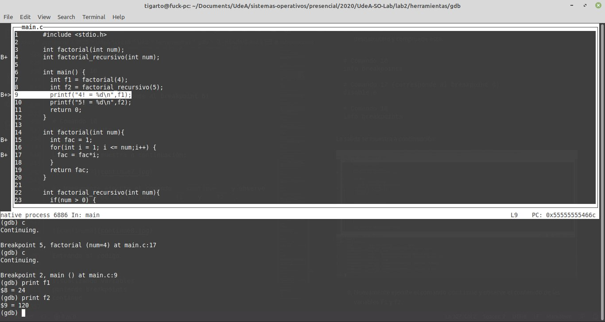


#### Step - Next - Finish ####

Estos dos comandos permiten ejecución paso a paso pero tienen una diferencia sutil. En lo que respecta al comando ```[s]tep```, este ejecuta la siguiente linea de codigo fuente pero si esta esta invocando una función, se entrará en esta; en lo que se refiere al comando ```[n]ext```, este tambien ejecuta la proxima linea de código pero a diferencia de ```step``` no desciente a la función que se invoca si la proxima linea del codigo esta asociada a esta.

Otro comando importante es el ```finish``` que continua la ejecución de una función hasta que encuentra el ```return``` asociado a esta.

Para comprender estos comandos un poco mas vamos a realizar las siguientes tareas.

1. Salgase del ```gdb``` y luego ingrese nuevamente cargando el archivo ejecutable ```main.out```.

```
quit
```

Iniciando nuevamente el gdb y cargando ```main.out```

```
gdb -tui main.out
```

2. Coloque un breakpoint en la función main e inicie la ejecución:

```
# Comando 1
b main

# Comando 2
run
```

La salida se muestra a continuación:

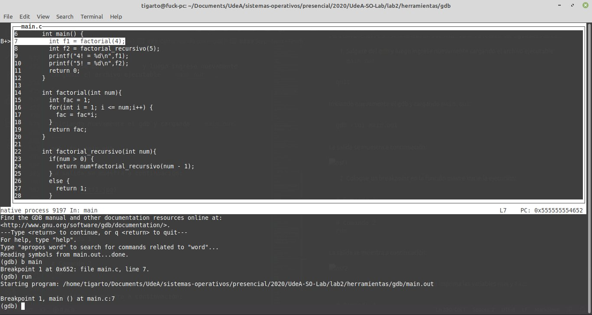

3. Ejecute el comando ```step``` y luego imprima las variables ```num``` y ```fac```:


```
# Comando 4
step

# Comando 5
print num

# Comando 6
print fac
```

La salida se muestra a continuación:

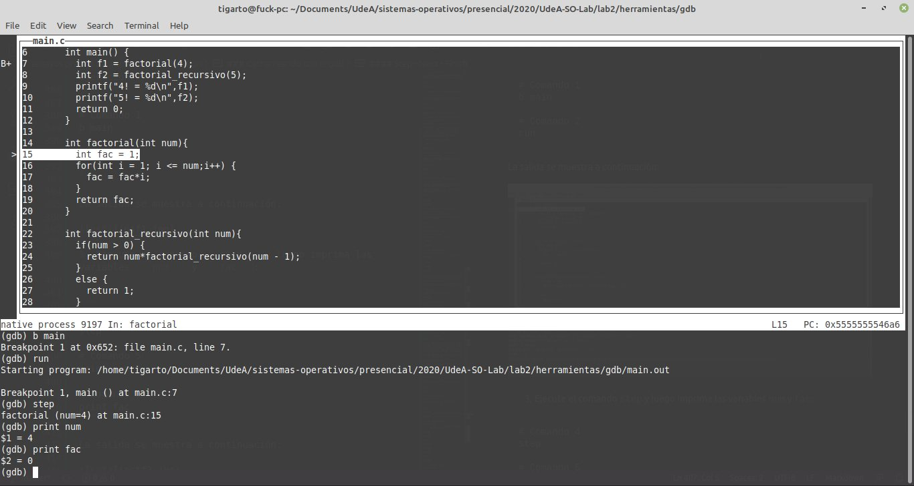

4. Ejecute el numero de veces que sea necesario el comando step imprimiento la variable  ```fac``` para ver su evolución hasta que esta alcance el valor de 2:

```
# Comando 7
s

# Comando 8
print fac

# Comando 9
# Continuar reiterativamente ele proceso anterior
```

La salida se muestra a continuación:

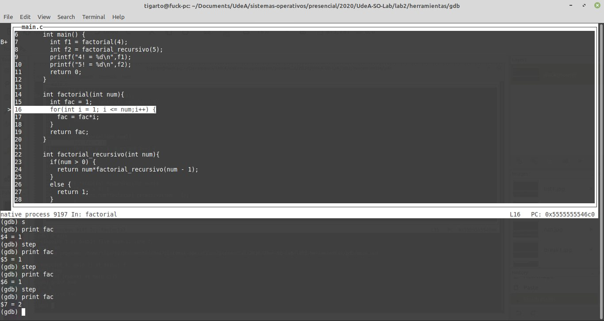

5. Ejecute el comando ```finish``` e imprima el valor de ```f1```:

```
finish

print f1
```

La salida se muestra a continuación:

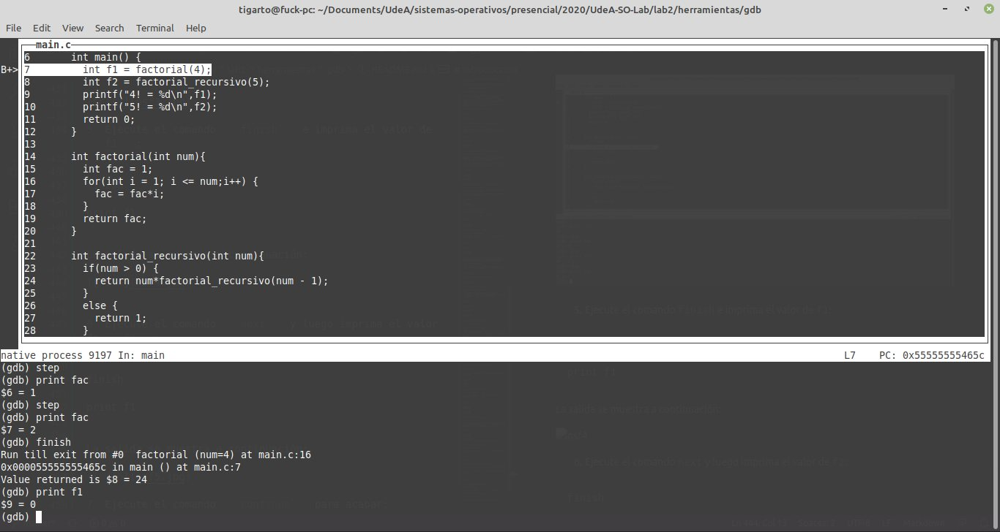


6. Ejecute dos veces el comando ```next``` imprimiendo el valor de ```f2```  despues de cada uno de estos:

```
n

print f2

n

print f2
```

La salida se muestra a continuación:

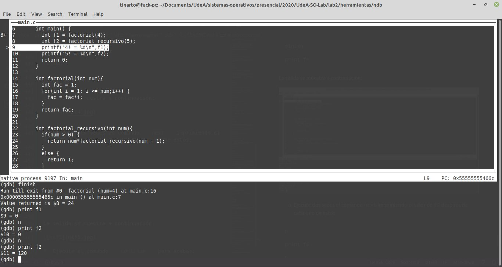

7. Ejecute el comando ```continue``` para acabar:


```
continue
```

La salida se muestra a continuación:

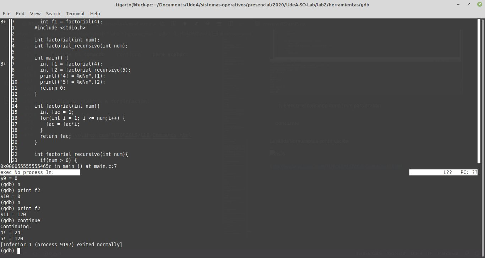


## Conclusiones ##

Hasta el momento solo vimos el uso mas básico del debuger de linux en modo texto. Esta es una herramienta sumamente poderosa y cuenta con una gran cantidad de comandos para probar codigo fuente. El proposito del curso no es profundizar en el manejo de este por lo que lo animamos a que lo cacharee, esa es la mejor forma de aprender.

## Refencias ##
Ademas de los enlaces y fuentes ya compartidas agregamos algunos enlaces mas para que consulte y profundice en el tema:
1. [GNU GDB Debugger Command Cheat Sheet](http://www.yolinux.com/TUTORIALS/GDB-Commands.html)